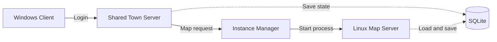

<p align="center">
  
</p>

<h1 align="center">Project Survivor</h1>

<p align="center">
  <strong>A server-authoritative online hack'n slash prototype inspired by Path of Exile and Vampire Survivors.</strong>
</p>

<p align="center">
  
  
  
  
</p>

## Overview

Project Survivor is my solo graduation project, built to explore the full technical stack behind an online action RPG.

Players begin in a shared town, create a character build, collect procedurally generated equipment and fight enemy waves alone or with other players. Each run takes place inside an independent map instance hosted by a dedicated Linux server.

The project focuses on multiplayer architecture, server-authoritative gameplay, scalable systems and persistent character progression.

| | |
|---|---|
| **Role** | Gameplay, networking and server systems |
| **Team** | 1 person, solo project |
| **Status** | In development |
| **Platform** | Windows client, Linux dedicated servers |
| **Development** | October 2025 to present |

## Key Features

- Server-authoritative combat built with Mirror and KCP.
- Dynamic map instances launched as separate headless Linux processes.
- Data-driven spells, damage types, tags, runes and character statistics.
- Procedural loot with rarity, item level, weighted affixes and tiered values.
- Persistent inventory, equipment, stash, party and character data.
- Secure player trading with server-side locks and double confirmation.
- Difficulty scaling that affects enemies, experience and loot rewards.
- Jenkins build and deployment workflow for the dedicated server.

## Multiplayer Architecture



When a player launches a map, the town server saves their state and asks the `InstanceManager` to create a new session. The manager assigns a port, generates a seed and starts a dedicated Unity server process with the selected map and difficulty.

Once the process is ready, the client disconnects from the town and reconnects to the new instance. Party members can also join one another across active server instances.

## Gameplay Systems

| System | Implementation |
|---|---|
| **Combat** | Damage and spell casts are resolved on the server, while clients receive synchronized visual feedback. |
| **Spells** | Tags such as Projectile, Fire, Cold, Lightning and Chaos determine which character bonuses affect each cast. |
| **Statistics** | A synchronized stat dictionary handles health, mana, resistances, armor, critical hits, elemental damage and progression. |
| **Loot** | Item bases, rarity, item level, prefixes, suffixes, tiers and weighted pools generate equipment at runtime. |
| **Currencies** | Sigils can add, reroll or transform affixes on existing equipment. |
| **Inventory** | Inventory, equipment and stash data are synchronized with Mirror and persisted between sessions. |
| **Trading** | Offered slots are locked by the server. Revisions, payload hashes, two validation steps and inventory snapshots protect the exchange. |
| **Party** | Players can form persistent parties and reconnect directly to another member's active map instance. |

## Code Highlights

| Area | Entry point |
|---|---|
| Dynamic server instances | [`InstanceManager.cs`](Assets/Scripts/Manager/InstanceManager.cs) |
| Server startup and command-line configuration | [`ServerBootStrap.cs`](Assets/Scripts/Network/ServerBootStrap.cs) |
| Server-authoritative spell framework | [`Spell.cs`](Assets/Scripts/Spells/Spell.cs) |
| Synchronized character statistics | [`StatsComponent.cs`](Assets/Scripts/Stats/StatsComponent.cs) |
| Procedural item generation | [`LootGenerator.cs`](Assets/Scripts/Loot/LootGenerator.cs) |
| Secure player exchange | [`TradeManager.cs`](Assets/Scripts/Trade/TradeManager.cs) |
| Persistent server data | [`DatabaseManager.cs`](Assets/ServerOnly/Database/DatabaseManager.cs) |
| Linux headless builds | [`BuildScript.cs`](Assets/Editor/BuildScript.cs) |

## Technical Stack

- Unity 6000.2.6f2 and C#
- Mirror Networking 96.0.1
- KCP transport
- Universal Render Pipeline
- SQLite and JSON serialization
- Linux headless dedicated servers
- Jenkins and GitHub

## Current Technical Focus

The main challenge is keeping enemy-heavy combat responsive while the server remains authoritative. Current work focuses on pooling, interest management, synchronization frequency and bandwidth usage so larger waves remain smooth for every connected player.

The project is an active technical prototype rather than a finished commercial release.

## Getting Started

1. Clone the repository:

   ```bash
   git clone https://github.com/Im0-R/Project-Survivor.git
   ```

2. Open the project through Unity Hub with Unity `6000.2.6f2`.
3. Open `Assets/Scenes/Menu.unity` to start from the client entry scene.
4. Configure the network address and ports for your environment before testing the dedicated server flow.

The repository contains the project source, but it does not include the production database or private server configuration.

## Author

Created by [Leo-Paul Vray](https://github.com/Im0-R), Gameplay Programmer focused on Unity, C#, multiplayer gameplay and scalable game systems.

[LinkedIn](https://www.linkedin.com/in/leopaulvray)
